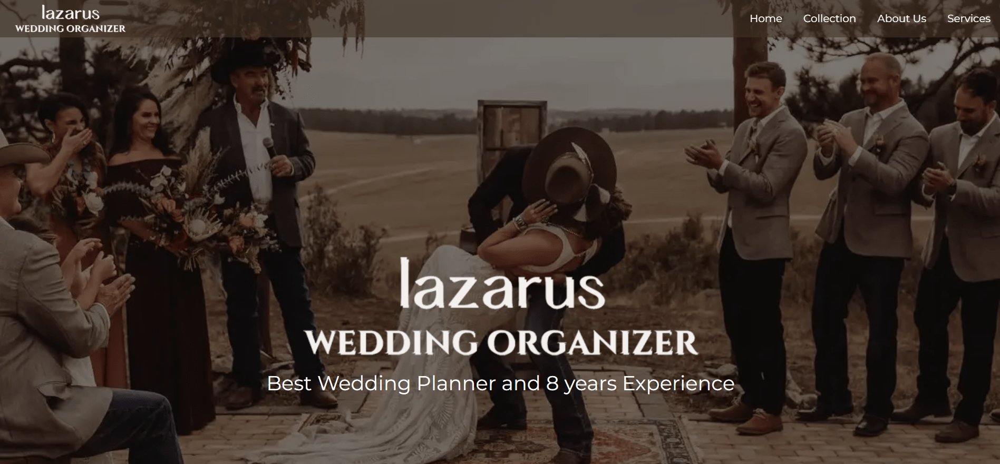

------------------------------------------------
# Hello There :D :smile:

I'm Jhonson, and I am proud of myself for my creation. I am delighted to present my _Mile stone Project_ named *[Lazarus Wedding Organizer](https://jhonson.tech/)*. The function of this website is to promote and brand our Wedding organizer with eight years of experience, trust, a Solid team, and many vendor connections. also, i give our social media so we can keep in touch for future planning, and I hope Mr/Ms also can submit personal information (email, name) for the future announcement

## STRUCTURE :open_book:

- Header
    - Logo
    - Navigasi
- Main
    - Section Front cover -
        contain image to front cover
    - Section Our Story -
        contain a little story about Lazarus
    - Section Why -
        this section for Why must choose Lazarus WO
    - Section Wedding Images 
    - Section content -
        contain few words try to attract visitor
    - Section Location -
        Contain google maps
    - Section Social Media -
        keep in touch
    - Section form 
- Footer

## LANGUAGES
- HTML
- CSS
- JavaScript

### Clone Project

##### Clone Project

### How to set up and run the project.
1. Open Web Netlify and login with GitHub

2. after that, click Add new site and Click deploy with GitHub

3. then choose to deploy with GitHub

4. After that, choose repository (revou-fsse-3)

5. select the repository that you wanted

6. Then click Deploy

7. Click Set Custom Domain

8. Click Awaiting External DNS

9. Copy apex ... and jhonson ...

10. after opening NiagaHoster and Clicking the DNS tab, insert one by one that copies. Paste to manage DNS Record.

11. and the last result, like the image below

12. wiat for the domain can use *[Domain jhonson.tech](https://jhonson.tech/)*

###  Dependencies or external libraries used in the project.

1. Using Font Awesome for Icon 

2. Using Iframe Google Maps

### Design choices or considerations made during the development process.

1. *[Reference 1](https://amartaorganizer.com/)* 
2. *[Reference 2](https://akuwedding.com/)* 

### Design in Lazarus and its use for

1. Have a navigation bar at the header (desktop view) and nav bar (mobile view)

2. using Grid 

3. Form

# :smile: THANK YOU :smile: